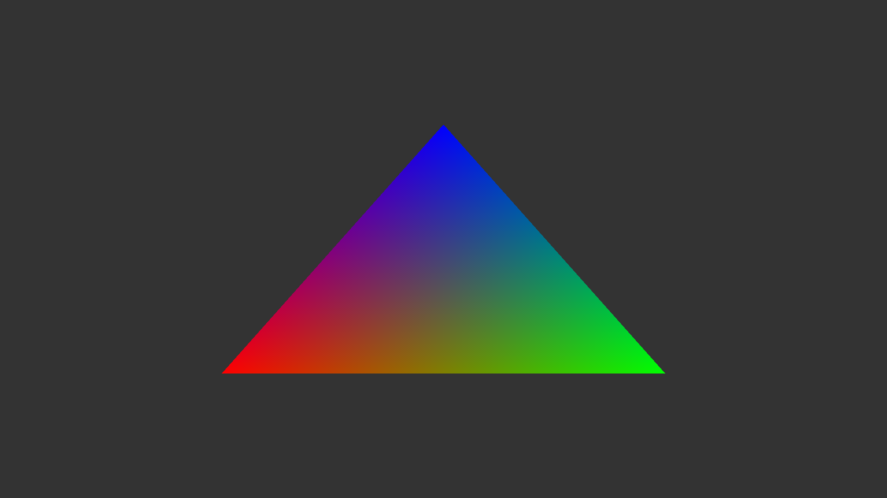

# Hello Triangle in Common Lisp

A classic OpenGL "hello triangle" written in Common Lisp using GLFW for windowing.



## Background

This repository was created in response to [a Hacker News comment by f1shy](https://news.ycombinator.com/item?id=46588512), who challenged:

> I asked [LLMs] for a code in common lisp, that renders the "hello triangle" a la opengl, using the glfw bindings, no frameworks. None of the responses compiled. After five iterations providing error messages, none compiled either. [...] If you have a prompt that achieves it, let me know I will test it.

This repository attempts to answer that question with a straightforward [Claude Code](https://claude.ai/code) run.

The user (philpax) has never used Common Lisp and did not have it installed. Claude Code was able to set up the entire project autonomously—researching the cl-glfw3 and cl-opengl APIs, creating the Nix environment, writing the code, and verifying it loads correctly—without any manual intervention or debugging assistance.

The prompt used was simply:

> Let's build a classic "hello triangle" for OpenGL in Common Lisp without using SDL, only OpenGL and GLFW. Create a shell.nix with all of the required dependencies; I do not have a Common Lisp environment.

## Requirements

- [Nix package manager](https://nixos.org/download.html)

## Usage

```bash
# Enter the development environment (installs SBCL, GLFW, Quicklisp automatically)
nix-shell

# Verify setup works (no window created)
sbcl --load setup.lisp --eval '(hello-triangle:verify-setup)' --quit

# Run the hello triangle
sbcl --load main.lisp --eval '(hello-triangle:run)'
```

Press **ESC** to close the window.

## Files

- `shell.nix` - Nix development environment with SBCL, GLFW, OpenGL, libffi
- `setup.lisp` - Loads dependencies, defines shaders and vertex data
- `main.lisp` - Window creation and render loop

## Details

- OpenGL 3.3 Core profile
- Modern programmable pipeline (vertex/fragment shaders)
- Classic RGB triangle with interpolated vertex colors
